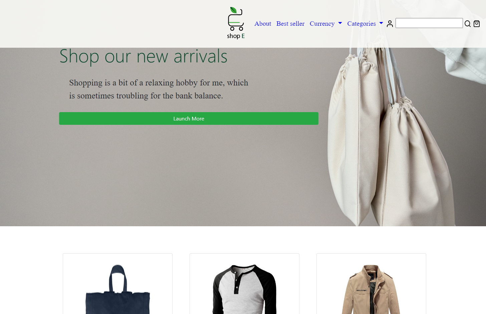

# Ecommerce Website

Our group wanted to sell some stuff online, so we came up with an idea that we can create this ecommerce website and sell it online.


## Demo



https://jemmy344.github.io/shop-ecommerce/


## Installation

Install our ecommerce website with git clone

```bash
  git clone git@github.com:jemmy344/shop-ecommerce.git
  cd shop-ecommerce
```
    
## Usage/Examples

You can use this project as an example how to create a basic ecommerce website.

## Credits

Jonatan Kwiatkowski, Liam Watson, Jemimah Jacobs & Kohl Vernon.
# License

Please refer to the LICENSE in the repo.


